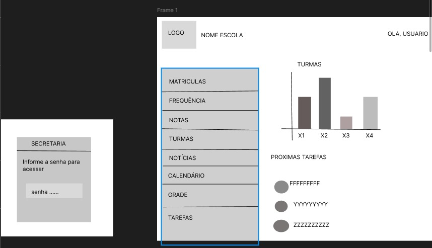
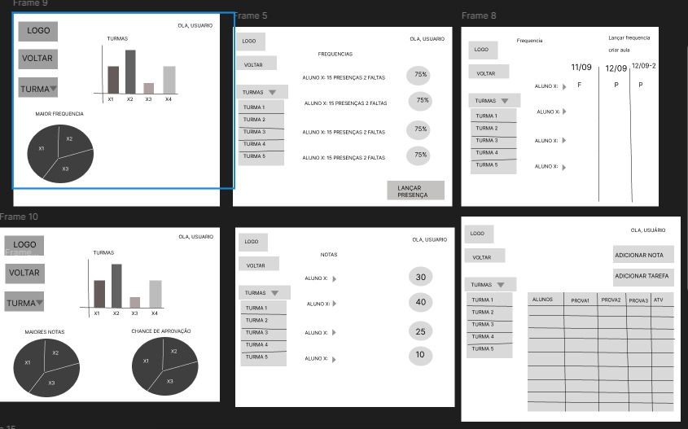
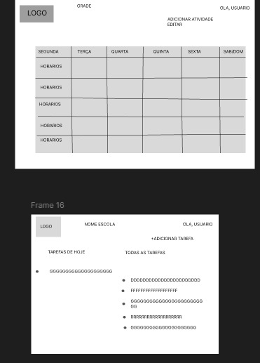
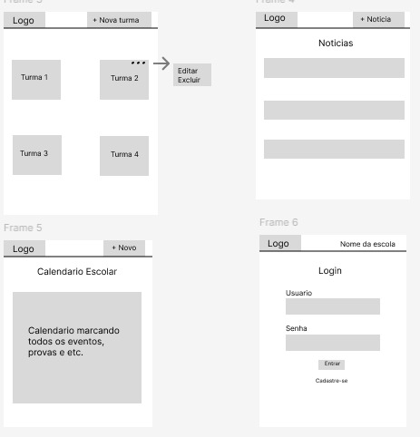

# 3. Projeto de Interface

**Pré-requisitos:** <a href="2-Especificação.md"> Documentação de Especificação</a>

Nesta seção, apresente as principais telas da plataforma e explique como a interface foi elaborada para atender aos requisitos funcionais, requisitos não funcionais e histórias de usuário definidos na Especificação do Projeto.

## 3.1 Wireframes

### O que são wireframes?

Wireframes são protótipos simples que representam a estrutura e o layout básico de um site ou aplicação web, destacando os elementos essenciais da interface e a organização das páginas.

### Exemplo de Wireframes
🗑️ _[Esta seção deve ser apagada e substituída pelos seus exemplos de wireframes ou mockups]_

## Wireframes por Tela
Login 2 e tela principal

Telas frequências e notas 

Tela grade e tarefas

Tela matriculas

Tela turmas, calendario, noticias, login 

...

 
> **Links Úteis**:
> - [Ferramentas de Wireframes](https://rockcontent.com/blog/wireframes/)
> - [MarvelApp](https://marvelapp.com/developers/documentation/tutorials/)
> - [Balsamiq](https://balsamiq.com/)

